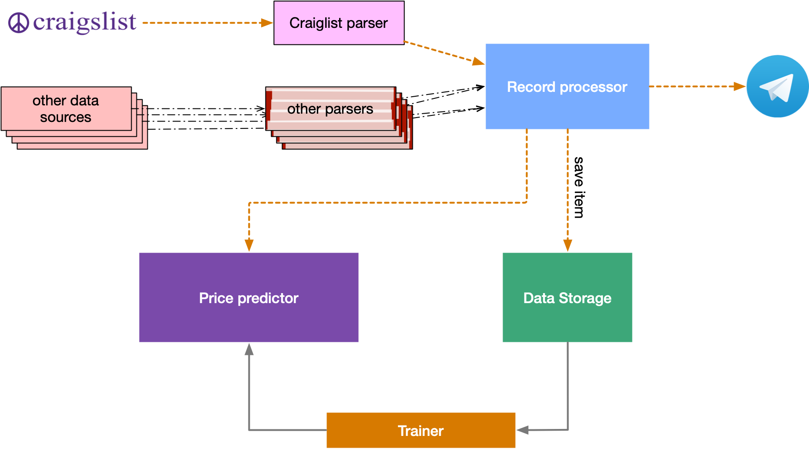

# aptsearcher

The system simplifies the search of an apartment.

## architecture draft

Periodically parser components parse results of apartment listing on the [craigslist](https://craigslist.org) and possibly other sources. Parsed results passed to the [record processor](#record-processor).

Record processor firs of all save every record to persistent storage. Saved items required for future model training.

Second, the record processor sends a request to the price predictor and compares the predicted price with a stated price.
If a stated price is much less than the predicted price system should inform users about a good deal.

## components

### craiglist parser

This parser parses Craiglist site for new apartment listings and grabs details of each new listing.

Possible implementation of parser: [apthunt](https://github.com/vistrcm/apthunt).

### Other parsers

Optional parser of additional resources: local websites, or others.

All parsers should implement the same interface.

### Record processor

The main logic applied to every record from any parser.

1) Save the record to the datastore,
2) use record data to predict the price of the listed apartment,
3) if the predicted price is higher than the stated price, send a notification.

Notification can be send via telegram channel.

### Data Storage

Please think carefully about what type of data store to use. It may be object storage like [AWS S3](https://aws.amazon.com/s3/), more complex key-value store like [Google Cloud Datastore](https://cloud.google.com/datastore/). Find a good solution designed for "mostly write" workloads. Do not introduce unnecessary complexity. Plus, think about the export of the whole database to the table-like format, for example, CSV.

Maybe multiple storages for different types of data: tabular, text, images.

### Price predictor

The price predictor is using a model created by (#trainer) to predict the price of the apartment based on input parameters.

Most probably straightforward web/gRPC application taking JSON data as input and return predicted price or bucket of predicted prices.

### Trainer

Trains a machine-learning model to predict apartment prices based on a dataset from the [Data Storage](#data-storage).

You can use any possible way to build and train the model. A couple of suggestions provided below.

You can use methods described in:

* [Fast.AI course, Lesson 4: NLP; Tabular data; Collaborative filtering; Embedding](https://course.fast.ai/videos/?lesson=4) tabular data example is a good fit for this task.
* [Machine Learning with TensorFlow on Google Cloud Platform Specialization](https://www.coursera.org/specializations/machine-learning-tensorflow-gcp) provides many insights on how to build a similar model with Tensorflow.

To provide results soon, you can start with a single model working on tabular data: predict the price based on numerical and categorical information.

The second step may be to train 3 different models:

* tabular - same as above,
* textual - model predicting the price based on the text description of the property,
* visual - model predicting the price based on photos of the property.

You can calculate the weighted average of model results and use it as a final prediction.

As the third step, you can create a single model considering all three types of data: tabular, text, and photos.

## code repository

Create a GitHub repository (public or private) that contains source code and installation instructions or extend existing [apthunt](https://github.com/vistrcm/apthunt) repository.
