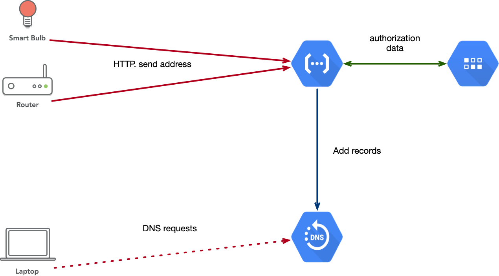

# dnsupdate

Cloud function to manage DNS records.

## problem statement

We have a network of different devices some of them are Internet-facing, some are not. Technical restrictions do not allow us to set FQDNs for these devices using traditional tools.

So we need to create service similar to [DynDNS](https://dyn.com/dns/).

## task

### functionality

Please create [cloud function](https://cloud.google.com/functions/) exposed via single https endpoint.

This function should accept 3 parameters: authorization `token`, `name` (note: this is not FQDN, only name) and `list of IP addresses`.

First, check authorization: can this client (`token`) change/add value for this particular `name`.

Suggestion: store auth information in the [Cloud Datastore](https://cloud.google.com/datastore/) "table". Using "token" as the index (Name/ID) and property "allowed_names" an array of names which can be changed by this token.

Example table:

| Name/ID                          | comment            | allowed_names    |
|----------------------------------|--------------------|------------------|
| 3a8dbe5ad5ef4afb99b3c47ba3cb8869 | Smart Lamp at home | home-lamp        |
| 9d474ebe254e4a92b9209166e68550e3 | home router        | home-router, web |
| 535516728de9487385748f0aa2dfa031 | Lab PC             | lab, dockerlab   |

In this example token `3a8dbe5ad5ef4afb99b3c47ba3cb8869` can add/change only name "home-lamp", but `535516728de9487385748f0aa2dfa031` can change two names "lab" and "dockerlab".

If the token is not authorized, return `403 Forbidden` to the client.

If a client with this token is allowed to change this name, please insert or update the corresponding record in a dedicated zone of [Cloud DNS](https://cloud.google.com/dns/).

The zone should be configurable.

### clients

Create shell scripts to register host in a DNS using this service for:

* Linux (Ubuntu/CentOs)
* macOS
* [RouterOS (by Mikrotik)](https://mikrotik.com/software)

Clients should send a list of IP addresses of interfaces, not some "external address" which can be behind a NAT.

### code repository

Create a GitHub repository (public or private) which contains source code and installation instructions.

### IPv6

Add support of IPv6 to both server and client.

## Notes

* Endpoint should be available only via httpS. Installation Instructions should include information on this.
* Think about HTTP API versioning.
* Think about the delivery pipeline for this application.
* Think about logging.
* Think about token identification, how we can extend this table to include this information.

## Possible changes

Feel free to change underlying technologies according to next map:

* [Cloud Functions](https://cloud.google.com/functions/) --> [AWS Lambda](https://aws.amazon.com/lambda/)
* [Cloud Datastore](https://cloud.google.com/datastore/) --> [Amazon DynamoDB](https://aws.amazon.com/dynamodb)
* [Cloud DNS](https://cloud.google.com/dns/) --> [Amazon Route53](https://aws.amazon.com/route53/)
