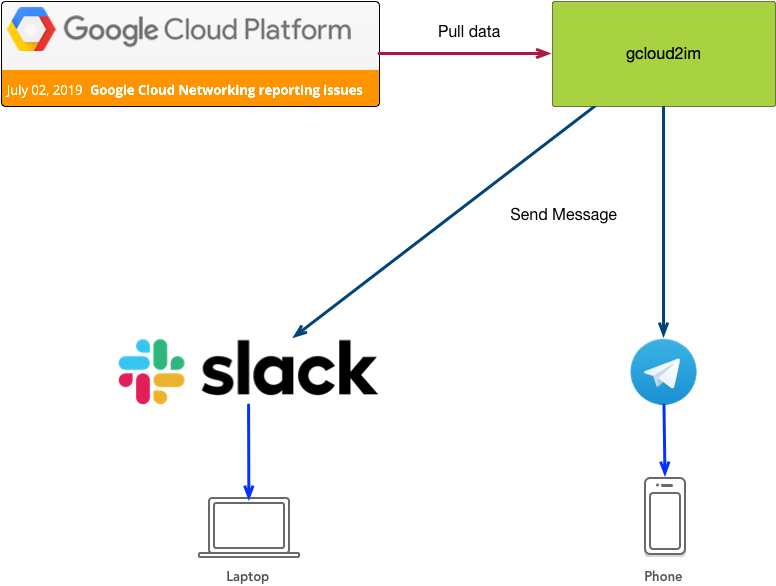

# gcloud2im

Read the stream of notifications from https://status.cloud.google.com/ and send notifications to the Slack or Telegram.

## problem statement

We need to receive notifications on Google Cloud problems as a message in [Telegram](https://telegram.org/) or [Slack](https://slack.com/).

Application can crawl data from the [Google Cloud Status Dashboard](https://status.cloud.google.com/) in two formats: [RSS](https://status.cloud.google.com/feed.atom) or [JSON](https://status.cloud.google.com/incidents.json). Please choose the best option.

If there is new incidents or updates in the existing incident application should send the message to the subscribed Telegram users or Slack.

### Telegram

Integrate with the Telegram via [Telegram Bot API](https://core.telegram.org/bots/api). Send updates to all subscribed users. Also, do not forget about help message.

### Slack

Please find the way to integrate with Slack. Most probably [Incoming Webhooks](https://api.slack.com/incoming-webhooks) is a good option for this.

### Deployment

This application is simple, so we don't need to use any servers for this. Please review available serverless platforms wisely and choose one. Possible candidates:

* [AWS Lambda](https://aws.amazon.com/lambda/)
* [Google Cloud Functions](https://cloud.google.com/functions/)
* [Cloud Run](https://cloud.google.com/run/)

### code repository

Create a GitHub repository (public or private) which contains source code and deployment scripts.

## Notes

* Please start with the simple working solution ([MVP](https://en.wikipedia.org/wiki/Minimum_viable_product)) with a single messaging app as a starter. All new tasks will be added as issues in the GitHub repository.
