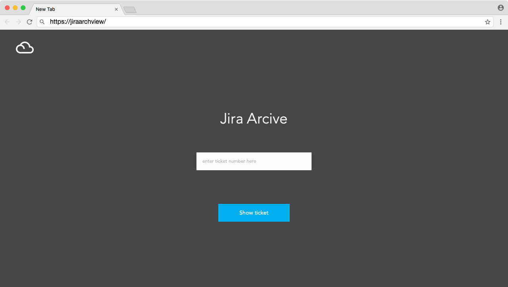
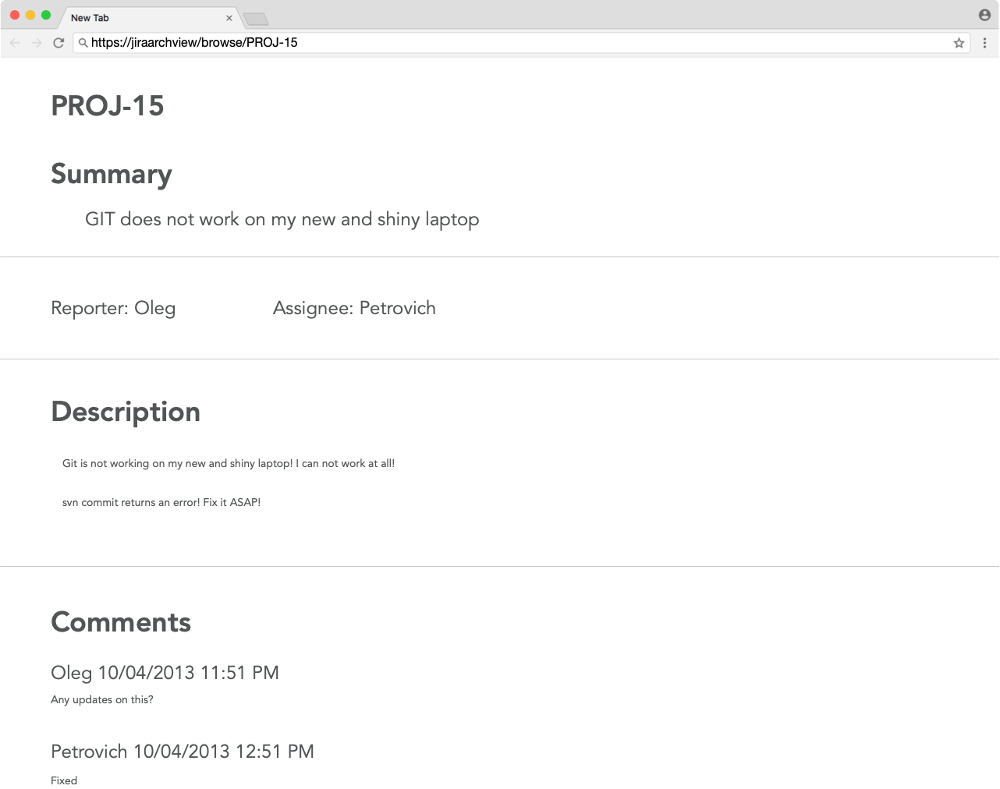
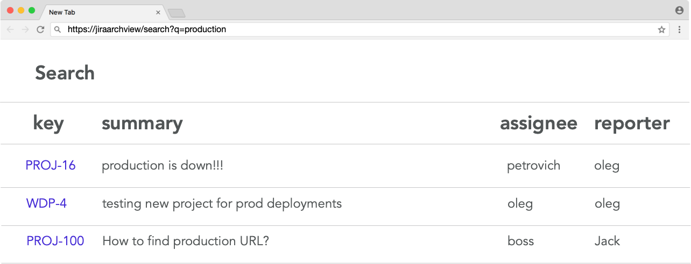
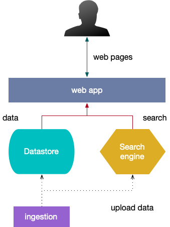

# jiraarchview

Jira Archive Viewer.

## problem statement

We have huge Jira Archive contains many JSON files in the form of `<jira_hostname>/<ticket_id>.json`.
The goal is to create a web application to browse this archive.

First stage: create an application capable of representing a Jira ticket. Users can open the main page (https://jiraarchview/), enter ticket number, and press "Show ticket."

After pressing the "Show ticket," the user will be re-directed to the page https://jiraarchview/browse/<ticket_id>, and major ticket fields will be shown on this page.

Second stage: add search capabilities.
Same home page, but button text changed to "search." User input Jira ticket number and get to browse page as well as any other information: assignee name, reporter, the text of the summary, or description. Maybe even comments.

If search phrase entered application should return a list of tickets.

Click on a "key" link to open the browse page of a ticket described above.

## possible architecture

Possible architecture. Not a hard requirement.

### datastore

Any datastore good for the task. It may be object storage like [AWS S3](https://aws.amazon.com/s3/) or [Google Storage](https://cloud.google.com/storage/), local files or document database like [MongoDB](https://www.mongodb.com/).

Please note that you have to choose wisely choosing the datastore, For example, a local filesystem is simple but not scalable, and non-document databases brings unnecessary complexity.

### web app

Use any programming language to create the application. The application should expose an HTTP interface for the user and communicate with the datastore to retrieve ticket information.

Note: think about local in-memory caching for faster results on the browse page. How to implement the cache? How to make sure it is not too big? TTL makes no sense - this is static data. Does [LRU cache](https://en.wikipedia.org/wiki/Cache_replacement_policies#Least_recently_used_(LRU)) works for this task?

On a second stage, the application should use a search engine to find tickets according to a search query.

### search engine

Any type of search engine. Common tools for the local installation is [Solr](https://lucene.apache.org/solr/) and [ElasticSearch](https://www.elastic.co/products/elasticsearch). Other tools are welcome.

If you like to write your search engine, first create a specification document for this engine. It helps to build great products.

### ingestion

Ingestion is a temporal step required to read data from data dump, transform it if required, and upload it to a data store and search index.

## code repository

Create a GitHub repository (public or private) that contains source code and installation instructions.
