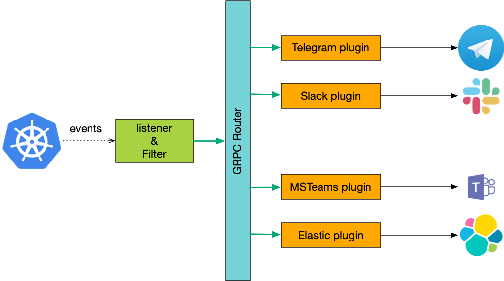

# k8slistener

A tool to listen for kubernetes events, filter them and send them to different channels. For example Slack/Telegram/MSTeams.

May be useful to send message to shared Slack chat about deployment or to collect records about all events in a cluster.

## architecture draft

## High-level tasks

Listener and filters should work separately, no need to re-deploy or restart plugins processes if the listener changed and vice versa.

One of the options to achieve this is to use gRPC and protocol buffers in particular.

Important: unit tests should cover all functionality.

### protocol buffers definitions

Create a folder with protocols defined for all gRPC communications. Define all required services, messages, and types of messages.

### events listener

Write an application that listens to k8s events. For each event compare with defined filter rules, if matches send event using corresponding message type defined in protocol buffers definitions to plugin processes via a router.

Filter rule examples:

* any event -> send to elastic
* deployment completed -> send to Slack chat
* deployment event by user expert@org.com -> send to Telegram

Filter rules may be defined via [kubernetes custom resources](https://kubernetes.io/docs/concepts/extend-kubernetes/api-extension/custom-resources/).

Plugins may be in the process of redeployment or network issue may cause an error.  The listener should implement retry logic with timing between retries changes according to exponential backoff. Make sure times are reasonable.

Log plugin response for troubleshooting reasons.

### load balancer

To avoid the necessity to create separate gRPC service and connection for each plugin, the listener should communicate with plugins via gRPC router. Please find a suitable router or implement one.

Requirements:

* route messages based on type. type=telegram -> telegram, type=elastic -> elastic
* balance requests across multiple instances of a plugin
* autodiscovery of new plugins and new instances of a plugin

### Slack plugin

Write an application that implements Slack integration. GRPC service which sends messages to a Slack channel via webhook integration.

### Telegram plugin

Write an appliction that implements Telegram integration. GRPC service which sends messages to a Telegram chat via telegram bot API.

### MS teams plugin

Write an application that implements MS Teams integration. GRPC service sends messages to an MS Teams channel via webhook integration.

### elk plugin

Write a plugin that stores all events to the ElasticSearch collection.
Create a schema for the collection (see [An Introduction to Elasticsearch Mapping](https://www.elastic.co/blog/found-elasticsearch-mapping-introduction) for details).
