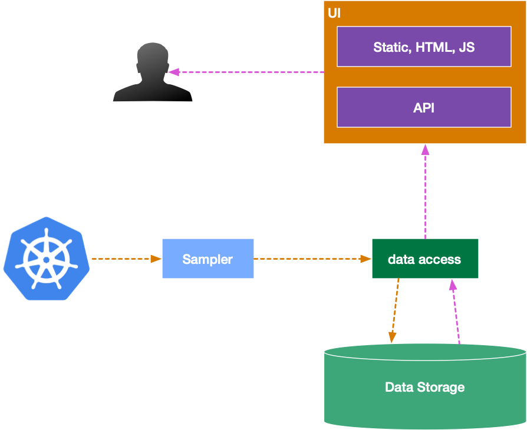

# resource advisor

Kubernetes resource advisor. The system collects kubernetes resource-level metrics and visualizes results to show insights on cluster usage and provide recommendations.

## idea

Kubernetes was created with an idea to utilize resources better. Unfortunately, many teams not fully understand the [idea of resource limits and requests](https://kubernetes.io/docs/concepts/configuration/manage-compute-resources-container/) and sets resource requests too high. Misuse of requested resources leads to massive kubernetes clusters and a waste of resources, especially in terms of CPU usage.

The idea of the system is to collect historical data on actual resource usage, requested resources, and limits. Historical data is visualized and used to provide suggestions for cluster administrators and developers to improve resource usage.

## architecture draft

### sampler

Use [kubernetes metrics](https://kubernetes.io/docs/tasks/debug-application-cluster/resource-metrics-pipeline/) and [Metrics Server](https://github.com/kubernetes-sigs/metrics-server) in particular to get pod and node-level data on resource usage.

### data access

I hope this is obvious that [different subsystems should not integrate via the data layer](https://youtu.be/wgdBVIX9ifA?t=559). It does not matter is it separate processes or internal modules of the application.

Data access component provides API representation of data operations.

### storage

Which type of storage is better for the task? Try to compare at least three different types (please do not compare MySQL with PostgreSQL; they are the same type) of data storages and write pros and cons on paper. Separately create a list of requirements for the storage and compare these lists to figure out the best fit.

How often to store data? Please do back of the envelope calculations and provide an estimate of how much data storage required to store N samples.
Based on this estimate, provide a suggestion on how often we should sample resource usage. Keep in mind that sampling should not miss short living (less than 30 minutes) jobs and spikes in CPU and memory usage.

### visualization

HTML templates are an option for the initial draft. In later stages, split UI into static and API components.

#### first stage

Display tabular data with resource usage per pod and per deployment. The table should include limits, requested resources, actual usage, and the "delta." Delta informs users about overutilization or underutilization.

Table data is an average of the metric over a selected period.

Average CPU data of a period of 24 hours.
| Pod                                 | CPU limit | CPU requested | CPU usage | Delta                                      |
|-------------------------------------|-----------|---------------|-----------|--------------------------------------------|
| redis-5f856685f4-2xvv7              | 10000m    | 1000m         | 10m       | **+990m**   |
| test-consul-0                       | 1000m     | 100m          | 90m       | +10m                                       |
| fluentd-gcp-v3.1.1-64hpg            | 1000m     | 100m          | 200m      | -100m                                      |
| prometheus-adapter-5469c45b78-tbspx | 2000m     | 4000m         | 200m      | **+3800m** |

Add a similar table for Memory data.

#### second stage

Extend UI with graph representation. See the draft below.

#### third stage

System provides recommendations to the user. For example: reduce requested CPU for the "grafana" deployment from 8000m to 100m.

## Deployment

Create deployment scripts to deploy all system components into the dedicated namespace of a cluster. All permissions should be clearly defined.

## SLO

95% of any requests should be less than 400ms.

Design a resilient system. The system should function during any cluster operations and should be able to survive the simultaneous failure of two cluster nodes.

Sampler failures should not cause missing data. In general, duplicates are better than missing data.

## advanced tasks

Think about the security of a system. Should we require authentication and authorization? If so, draft and implement [OAuth 2.0](https://en.wikipedia.org/wiki/OAuth) based authorization. Delegate authentication to 3rd party.

One of possible solutions for this in golang is [go-pkgz/auth](https://github.com/go-pkgz/auth) package.

## code repository

Create a GitHub repository (public or private) that contains source code and installation instructions.
