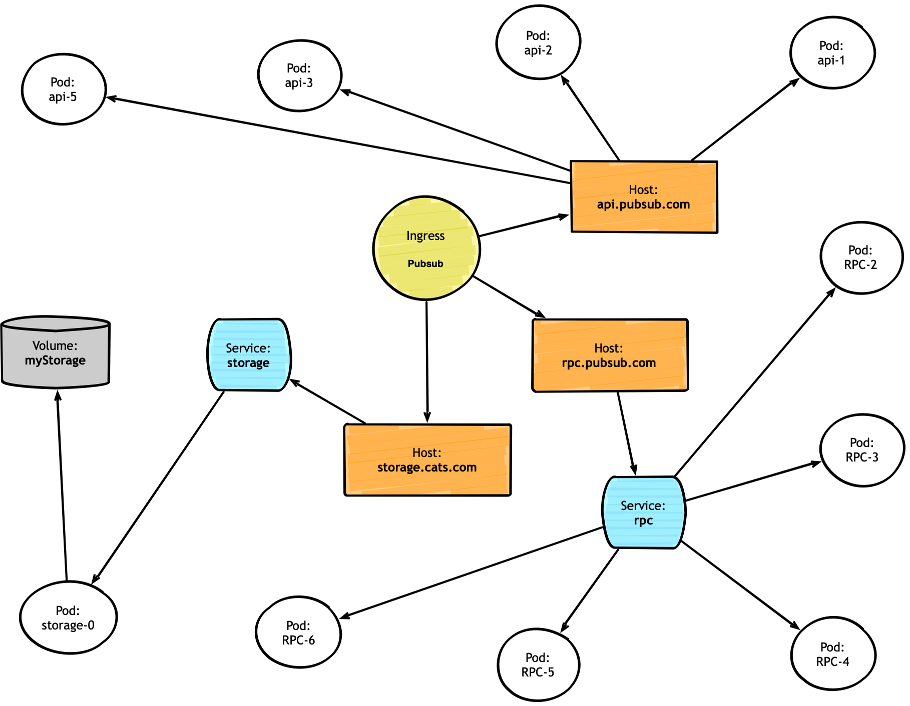

# servicegraph

A tool to visualize connections between API objects in the kubernetes cluster.

## problem statement

Sometimes it may be useful to visualize dependencies between different kubernetes objects. In particular between Ingress, Services, Pods, and Volumes. This Visualization can help to identify incorrect selectors and show the overall complexity of deployment.

Example image:



## task

Create web service which will be running inside desired kubernetes cluster and visualize connections between entries.

### functionality

#### Main page

The main page of service should give a short description of itself and provide the user at least two links: link to the image and link to the HTML page with a graph build by Javascript.

#### Image Generation

Generate PNG image with reasonable size on `/api/v1/graph` if header Accept is `image/png`

```
Accept: image/png
```

#### Json API

Expose api endpoint `/api/v1/graph` in formats usable by [D3.js](https://d3js.org/)

* [Cluster Dendrogram](https://observablehq.com/@d3/cluster-dendrogram)
* [Force Directed Graph with Labels](https://bl.ocks.org/heybignick/3faf257bbbbc7743bb72310d03b86ee8)

Select type of response using [Accept header](https://www.w3.org/Protocols/rfc2616/rfc2616-sec14.html):

* ```Accept: application/json; family=clusterDendrogram``` for Cluster Dendrogram;
* ```Accept: application/json; family=labelDAG``` for Force Directed Graph with Labels.

#### D3.js HTML page

Create an HTML page with D3.js code provided in the examples above to consume data from API above.

##### listen to events and update cached

Image generation can take some time, plus scrapping all the data from the cluster is expensive. One of the possible optimizations:

* move graph data to some cache;
* start dedicated thread/goroutine/process which will be listening events in k8s cluster and update cache accordingly;
* use cached data to serve user requests;

### Additional requirements

* application able to run inside k8s cluster and externally;
* Docker image of the application should be minimal;

### code repository

Create a GitHub repository (public or private) which contains source code and installation instructions.

### Possible technologies/libraries

* [gographviz](https://github.com/awalterschulze/gographviz) if you are using Golang. See [Using Golang and Graphviz to Visualize Complex Grails Applications](https://ilikeorangutans.github.io/2014/05/03/using-golang-and-graphviz-to-visualize-complex-grails-applications/) for details.
* [NetworkX](https://networkx.github.io) for python.
